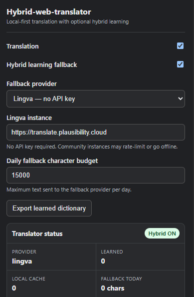
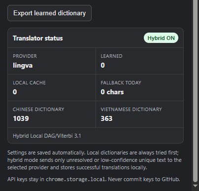

# Hybrid-web-translator

A lightweight, local-first Chrome extension that translates **Chinese and Vietnamese into English** while preserving page structure and interactivity.

It uses local language dictionaries first and can optionally call an external translation provider for unresolved or low-confidence text. Successful fallback translations are learned locally and reused later.

## Features

- Chinese → English and Vietnamese → English
- Local-first translation
- Independent language dictionaries: `zh.js` and `vi.js`
- DAG/Viterbi-based local segmentation
- Optional hybrid learning fallback
- Automatic learning and local reuse of fallback translations
- Automatic settings saving
- Configurable daily fallback character budget
- Dynamic DOM translation with `MutationObserver`
- Support for dynamically inserted posts, comments, navigation and UI text
- Mixed-language text handling
- Translation inside supported frames
- Learned dictionary export
- Built-in corpus crawler and dictionary development tools
- No page HTML replacement or DOM reconstruction

## Interface

Settings are saved automatically when changed. There is no separate Save button.



The popup includes controls for translation, hybrid learning, fallback provider configuration, the daily fallback character budget, and learned-dictionary export.

## Translator status



The status panel shows the current hybrid state, active provider, learned-entry count, local cache size, daily fallback usage, and the number of loaded Chinese and Vietnamese dictionary entries.

## How it works

```text
Page text
   ↓
Language detection
   ↓
Local dictionary
   ↓
DAG / Viterbi segmentation
   ↓
Local translation + cache
   ↓
Resolved confidently?
   ├── Yes → Apply translation
   └── No
        ↓
   Hybrid fallback (optional)
        ↓
   External provider
        ↓
   Successful translation
        ↓
   Learned locally
        ↓
   Reused without another fallback request
```

The local engine is always attempted first. Hybrid mode fills gaps in the local dictionaries instead of acting as the primary translation engine.

## Language dictionaries

Dictionary data is independent from the translation engine and organized only by language:

```text
dictionaries/
├── registry.js
├── zh.js
└── vi.js
```

`zh.js` contains Chinese → English entries and `vi.js` contains Vietnamese → English entries. `registry.js` initializes the dictionary objects consumed by the engine.

There are no website-specific dictionaries. New vocabulary can be added to the appropriate language file without modifying `content.js`.

## Hybrid learning

Hybrid learning sends only unresolved or low-confidence text to the selected provider. Successful results are stored in `chrome.storage.local` and reused when the same source text appears again.

The learned dictionary can be exported from the popup as JSON for review and permanent integration into the local dictionaries.

### Fallback providers

The current version supports:

- **Lingva** — configurable instance; no API key required by the extension.
- **LibreTranslate** — configurable endpoint with optional API key.
- **Google Cloud Translation** — requires a Google Cloud Translation API key.
- **DeepL API** — requires a DeepL API key.

Availability, quotas, rate limits, pricing, and authentication requirements are controlled by each provider or instance.

## Dynamic content and performance

After the initial translation pass, a `MutationObserver` watches for new or changed text nodes instead of continuously rescanning the entire page.

This allows newly loaded interface elements, posts, comments, and other dynamic content to be translated while reducing unnecessary CPU usage. Leading and trailing whitespace are preserved when text is replaced to reduce layout changes.

## Installation

1. Download or clone the repository.
2. Open `chrome://extensions`.
3. Enable **Developer mode**.
4. Click **Load unpacked**.
5. Select the project directory containing `manifest.json`.

For normal end-user installation without Developer mode, distribute the extension through the Chrome Web Store.

## Project structure

```text
Hybrid-web-translator/
├── manifest.json
├── content.js
├── service_worker.js
├── popup.html
├── popup.js
├── dictionaries/
│   ├── registry.js
│   ├── zh.js
│   └── vi.js
├── tools/
│   ├── corpus_crawler.py
│   ├── build_dictionary.py
│   ├── crawl.bat
│   ├── crawl.sh
│   ├── requirements.txt
│   └── README.md
├── docs/
│   └── images/
│       ├── hybrid-settings-v3.3.png
│       └── translator-status-v3.3.png
├── CONTRIBUTING.md
├── SECURITY.md
├── THIRD_PARTY_NOTICES.md
└── LICENSE
```

## Corpus crawler

The repository includes a Python crawler for collecting Chinese and Vietnamese text from public web pages for dictionary research.

It can follow allowed public links, extract and deduplicate target-language text, preserve source/context information, skip strings already present in `zh.js` or `vi.js`, resume crawls with SQLite, and optionally render JavaScript-heavy pages with Playwright.

The crawler respects `robots.txt` by default and rate-limits requests.

Install the basic dependencies:

```bash
python -m pip install -r tools/requirements.txt
```

**Windows**

```bat
tools\crawl.bat --max-pages 5000 --delay 1.5
```

**Linux**

```bash
bash tools/crawl.sh --max-pages 5000 --delay 1.5
```

For JavaScript-rendered pages:

```bash
python -m pip install playwright
python -m playwright install chromium
bash tools/crawl.sh --render-js example.com --max-pages 5000 --delay 1.5
```

The crawler is a development tool only. Python is **not** required to use the Chrome extension.

## Privacy

Known dictionary translations are processed locally.

When hybrid learning is enabled, unresolved text may be sent to the fallback provider selected by the user. API keys and learned translations are stored in `chrome.storage.local`.

Never commit API keys, private credentials, or other secrets to the repository.

## Development

Normal vocabulary updates require changes only to:

```text
dictionaries/zh.js
dictionaries/vi.js
```

Translation-engine behavior remains separate in `content.js`.

See `CONTRIBUTING.md` for contribution guidelines, `SECURITY.md` for security information, and `THIRD_PARTY_NOTICES.md` for third-party acknowledgements.

## License

The original Hybrid-web-translator source code is distributed under the license included in `LICENSE`.

Third-party resources retain their respective licenses. See `THIRD_PARTY_NOTICES.md` for attribution and licensing details.
