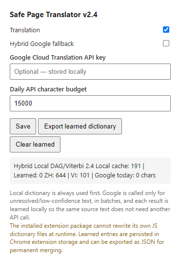

# Hybrid-web-translator

A low-CPU Chrome extension that translates **Chinese and Vietnamese web pages into English while preserving the original DOM and page interactivity**.

Hybrid-web-translator was created for pages where full-page machine translation can interfere with layout, controls, event handlers, or dynamically rendered content. Instead of replacing page HTML, the extension translates text nodes and a small set of safe text attributes in place.

Version **2.4** uses a hybrid architecture: a fast local dictionary/segmentation engine handles translation first, while an optional Google Cloud Translation fallback is used only for unresolved or low-confidence text. Successful fallback translations are learned locally and reused on later visits.

### Hybrid mode settings



The popup provides direct control over local translation, the optional Google Cloud Translation API fallback, the daily API character budget, and the learned local dictionary. An API key is **not required** for normal offline/local translation; it is only required when the optional hybrid fallback is enabled.

## Features

- Chinese (Simplified/Traditional-oriented lexicon) → English
- Vietnamese → English
- Local-first translation with no network requirement for known text
- Optional Google Cloud Translation Basic fallback
- Persistent learned translation dictionary
- Batches fallback requests to reduce API usage
- Configurable daily Google API character budget
- Exact translation cache and request deduplication
- Chinese phrase matching with DAG / frequency-based dynamic-programming segmentation
- Domain vocabulary for games, forums, source-code communities, software and server administration
- Vietnamese phrase-first matching
- Preserves existing DOM elements and JavaScript event handlers
- Supports dynamically inserted content through `MutationObserver`
- Uses idle/batched DOM processing to reduce main-thread spikes
- Can translate selected safe attributes such as `title`, `placeholder`, and `aria-label`
- Learned dictionary export for later curation or bundling

## Why this approach?

Conventional page translators may rebuild or wrap page content. On older forums, game-resource sites, SPAs, and heavily scripted pages, this can occasionally make controls difficult to use or alter the layout.

Hybrid-web-translator follows a narrower strategy:

```text
Page DOM
   │
   ├─ Text nodes / safe text attributes
   │
   ├─ Local exact dictionary
   │
   ├─ Local phrase/domain dictionary
   │
   ├─ Chinese DAG + frequency-based segmentation
   │      or Vietnamese phrase matching
   │
   ├─ Local English reconstruction / spacing cleanup
   │
   └─ Optional low-confidence fallback
          │
          └─ Google Cloud Translation
                 │
                 └─ learned locally for future reuse
```

The extension does **not** replace `innerHTML` during normal translation. Scripts, styles, code blocks, editable areas, SVG, canvas, and other unsafe/non-text regions are skipped.

## Installation

### Load unpacked

1. Clone or download this repository.
2. Open `chrome://extensions` in Chrome.
3. Enable **Developer mode**.
4. Click **Load unpacked**.
5. Select the repository directory containing `manifest.json`.
6. Browse to a Chinese or Vietnamese page.

The local translator works without an API key.

## Optional hybrid translation

The Google fallback is **disabled by default**.

To enable it:

1. Create/configure a Google Cloud project with Cloud Translation enabled.
2. Create an API key suitable for Cloud Translation Basic.
3. Open the extension popup.
4. Enter the API key.
5. Enable **Hybrid Google fallback**.
6. Set a daily character budget.
7. Save.

Do **not** commit an API key to this repository or distribute an unrestricted key in a packaged extension.

The hybrid engine only queues text that the local engine considers unresolved or low-confidence. Unique strings are deduplicated, requests are batched, and successful translations are stored in `chrome.storage.local`. Chrome documents `chrome.storage` as extension-specific persistent storage; this project requests `unlimitedStorage` so the learned dictionary can grow beyond the normal local-storage quota.

## Translation pipeline

### Chinese

The local Chinese engine uses:

1. Exact learned translations
2. Exact bundled phrases
3. Domain-specific phrases
4. Prefix-index candidate generation
5. A DAG of possible tokenizations
6. Frequency-weighted dynamic programming to choose a segmentation
7. Local dictionary lookup
8. English reconstruction and spacing cleanup

This design is inspired by the general segmentation strategy documented by **Jieba**, which uses a prefix dictionary, DAG generation, word frequencies and dynamic programming for maximum-probability segmentation. Hybrid-web-translator contains its own JavaScript implementation rather than embedding Jieba itself.

### Vietnamese

Vietnamese translation prioritizes longer phrases before individual terms. This is important because Vietnamese lexical units may consist of multiple space-separated syllables.

### Hybrid learning

When enabled, the fallback works as a teacher for the local engine:

```text
Unknown / low-confidence source text
              │
              ▼
      Google translation
              │
              ▼
    chrome.storage.local
              │
              ▼
Exact local hit next time
```

Use **Export learned dictionary** from the popup to export learned pairs as JSON for review or future integration into the bundled dictionaries.

## Project structure

```text
hybrid-web-translator/
├── manifest.json
├── content.js
├── service_worker.js
├── popup.html
├── popup.js
├── dictionaries/
│   ├── zh.js
│   └── vi.js
├── tools/
│   └── build_dictionary.py
├── README.md
├── LICENSE
├── THIRD_PARTY_NOTICES.md
└── .gitignore
```

## Building a larger Chinese dictionary

`tools/build_dictionary.py` can preprocess a CC-CEDICT text dump into a compact JavaScript dictionary overlay.

```bash
python tools/build_dictionary.py cedict.txt dictionaries/cedict.generated.js 60000
```

The generated file is **data derived from CC-CEDICT** and therefore must retain the applicable CC-CEDICT attribution and CC BY-SA 4.0 terms. See `THIRD_PARTY_NOTICES.md` before distributing generated dictionary data.

The script intentionally filters some variants/noise and prefers concise English glosses to keep browser lookup practical.

## Performance design

The project intentionally avoids running a local neural translation model continuously. Its hot path is mostly string scanning, indexed dictionary lookup, caching, and DOM text replacement.

Performance measures include:

- Prefix-indexed phrase candidates instead of scanning the entire dictionary
- Translation cache
- Learned exact-match cache
- Deduplicated fallback queue
- Batched Google requests
- Incremental `MutationObserver` processing
- `requestIdleCallback`/batched initial traversal where available
- No periodic full-page rescans
- No translation work for blocked elements
- Local-first translation before any network fallback

## Privacy

With hybrid fallback disabled, translation is local to the browser.

When hybrid fallback is enabled, unresolved/low-confidence text selected by the extension is sent to the configured Google Cloud Translation endpoint. Do not enable the fallback on pages containing sensitive information unless that behavior is acceptable for your use case and Google Cloud configuration.

The Google API key and learned translations are stored locally through Chrome extension storage. Review `service_worker.js` and `content.js` before deployment if you need stricter data-handling requirements.

## Permissions

The current manifest requests:

- `storage` — settings, cache and learned translations
- `unlimitedStorage` — allows the learned dictionary to grow beyond the standard `storage.local` quota
- `activeTab` — popup interaction with the current page
- `downloads` — export of the learned dictionary
- `<all_urls>` — content-script translation on arbitrary pages
- `https://translation.googleapis.com/*` — optional hybrid fallback

For a public Chrome Web Store release, consider narrowing host access or moving broad site access to optional host permissions if that fits your distribution model.

## Credits and references

Hybrid-web-translator's implementation was informed by the following projects, datasets and documentation. Unless explicitly stated, they are **references/inspirations and are not vendored dependencies** in this repository.

- **CC-CEDICT** — community-maintained Chinese–English dictionary. The dictionary data is distributed under **CC BY-SA 4.0**. The included build tool can generate an optional dictionary from CC-CEDICT data.
- **Jieba (`fxsjy/jieba`)** — reference for efficient Chinese segmentation concepts: prefix dictionary, DAG construction, word-frequency scoring, dynamic programming, and custom dictionaries. Jieba is MIT-licensed. This project uses an independently written JavaScript implementation of those general ideas.
- **jieba-tw** — useful reference for Traditional Chinese segmentation and Jieba's MIT licensing lineage.
- **open-vn-en-dict (`samuraitruong/open-vn-en-dict`)** — reference for Vietnamese/English dictionary resources and dictionary organization. The repository is MIT-licensed. Its README identifies upstream dictionary sources; verify upstream data rights before redistributing imported data.
- **Chrome Extensions / Manifest V3 documentation** — reference for content scripts, permissions, `chrome.storage`, service workers, and extension architecture.
- **Google Cloud Translation** — optional network fallback used only when explicitly enabled by the user.

See `THIRD_PARTY_NOTICES.md` for licensing details and redistribution notes.

## License

The **software source code written for Hybrid-web-translator** is licensed under the MIT License. See `LICENSE`.

Dictionary datasets can have separate licenses. In particular, any dictionary generated from CC-CEDICT remains subject to **CC BY-SA 4.0** and is not relicensed under MIT merely by being distributed with this project. See `THIRD_PARTY_NOTICES.md`.

## Contributing

Contributions are welcome. Useful areas include:

- Better Chinese segmentation/frequency data
- Curated game/software/forum terminology
- Vietnamese phrase segmentation
- Spacing and punctuation reconstruction
- Lower-cost confidence scoring
- Safer site-specific DOM handling
- Tests for mixed Chinese/English technical text

When contributing dictionary data, include its source and license. Do not submit scraped proprietary dictionary data without redistribution rights.

## Disclaimer

Machine and dictionary-based translation can be inaccurate. Do not rely on this extension as the sole translation source for legal, medical, financial, safety-critical, or other high-stakes content.
