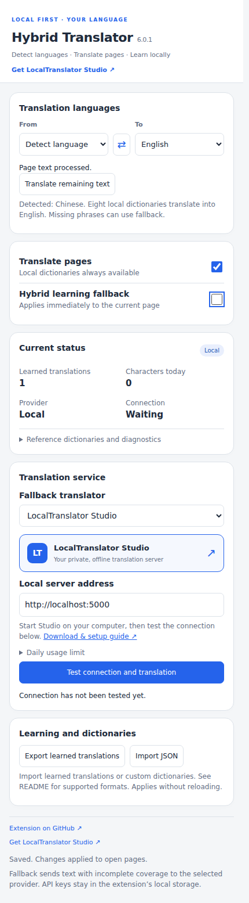

# Hybrid Web Translator

**Local dictionaries first. Optional online translation services when you need them.**

[Português (Brasil)](readme-ptbr.md) · [LocalTranslator Studio](https://github.com/marcusbsilva/LocalTranslator-Studio) · [Dictionary sources](THIRD_PARTY_NOTICES.md)

A Manifest V3 browser extension that translates page text with local dictionaries, detects languages, and learns completed translations from an optional manually enabled fallback. Version **6.0.1** refreshes the interface and connects the local provider to LocalTranslator Studio.



[View dark theme](docs/images/popup-v6-dark.png)

## Features

- Detect language → English defaults; selectable source and destination.
- Chinese, Vietnamese, Thai, Russian, Portuguese, Spanish, French and Japanese dictionaries, with English as the bridge for other destinations.
- Local bilingual indexes and learned translations scoped to the selected language pair.
- Dynamic page text and supported text attributes processed without translating scripts or editable fields.
- Manual fallback activation, applied immediately to the current page.
- LocalTranslator Studio, Lingva, Google Cloud Translation and DeepL providers.
- Connection diagnostics, remaining-text retry, JSON import/export and local usage statistics.
- Clean light/dark styling following the system preference.

Dictionary entry counts describe vocabulary, not guaranteed coverage of arbitrary sentences. Unknown text may remain untranslated when fallback is disabled. Local dictionaries and learned entries do not need a translation server.

## Installation

1. Extract the ZIP into a fresh folder to avoid carrying obsolete files forward.
2. Open `chrome://extensions` or `edge://extensions`.
3. Enable **Developer mode**, choose **Load unpacked**, and select the folder containing `manifest.json`.
4. Reopen existing website tabs once after installing/upgrading the extension.

Subsequent setting changes and fallback activation apply immediately. Keep the same extension directory when replacing an existing unpacked installation if you want to retain its browser identity and stored dictionaries; remove obsolete generated folders from that directory separately.

## Private local translation with Studio

This version includes a ready-to-go integration with **LocalTranslator Studio** a dedicated local-server translator.

1. Download and install [LocalTranslator Studio](https://github.com/marcusbsilva/LocalTranslator-Studio) separately.
2. Start its server with `start.bat` on Windows or `bash start.sh` on Linux.
3. In the extension, select **LocalTranslator Studio** and enter `http://localhost:5000` (or your chosen port).
4. Use **Test connection and translation**.
5. Enable **Hybrid learning fallback** manually when you want uncovered text translated.

The extension does not start, bundle or install the server. No API key is needed for Studio. Its Models page manages installed languages. Diagnostics report missing source/target models and translation errors.

Local endpoints on `localhost`, `127.0.0.1` and `[::1]` bypass the daily fallback budget; usage is still counted. External services retain the configured budget. The fallback never enables itself when you choose another language.

Existing obsolete local-provider settings are mapped to Studio on first use. A previous valid local-server address is preserved when available, along with learned translations and the manual fallback preference. Start the separate Studio application at that address.

## Other providers and privacy

| Provider | Configuration | Processing |
|---|---|---|
| LocalTranslator Studio | Server address | On your computer for a loopback address |
| Community Lingva | Instance URL | External community service |
| Google Cloud Translation | API key | External Google service |
| DeepL | API key | External DeepL service |

With fallback disabled, dictionary matching stays local. Enabling fallback sends eligible page text to the selected provider. Keys, settings and learned entries are kept in extension local storage. Public instances may be unavailable; diagnostics and cooldowns help report failures but cannot guarantee service availability. See [SECURITY.md](SECURITY.md).

## Dictionaries and crawler

The release preserves the existing curated/general dictionaries, bilingual packs, source manifests and licensing material. Curated meanings take priority; ambiguous glossary senses are excluded from automatic matching. See [README-DICTIONARIES.md](README-DICTIONARIES.md) and [tools/README.md](tools/README.md).

The text-only crawler reads site URLs from `tools/sites.txt`, skips known phrases, and writes incremental dictionary output. Its default translation server is `http://localhost:5000`; overriding it is optional:

```bat
tools\crawl.bat
tools\crawl.bat --translate-url http://localhost:5001
```

```sh
bash tools/crawl.sh
bash tools/crawl.sh --translate-url http://localhost:5001
```

Use `--no-translate` for text collection only. Install crawler requirements as described in its guide. Crawl outputs, caches and compiled Python files are generated locally rather than shipped in this release.

## Development and validation

JavaScript core/worker tests run with Node.js. Browser tests additionally require Playwright and Chromium:

```sh
node tests/engine.test.cjs
node tests/worker.test.cjs
node tests/routing.test.cjs
node tests/local-budget.test.cjs
node tests/provider-migration.test.cjs
```

See [docs/VALIDATION.md](docs/VALIDATION.md) for actual checks and limitations. Browser API mocks test behavior but are not equivalent to a real installed-extension session. Dictionaries are not neural model weights and do not guarantee Google-equivalent output.

The extension directory includes its implementation, tests, dictionary sources and notices. It no longer includes a server distribution, container launchers, crawler databases or a duplicate dictionary ZIP.

## License

Original extension code: [MIT](LICENSE). Dictionaries retain their individual CC BY-SA / GPL and other source-specific terms. Required notices, credit headers and applicable corresponding source archives remain in `third_party` and the source manifests. Do not remove these when redistributing dictionary packs.

Related local application: [LocalTranslator Studio](https://github.com/marcusbsilva/LocalTranslator-Studio). Author: [Marcus Silva](https://github.com/marcusbsilva).

### Updating to 6.0.1

Extract the complete package into the folder shown under **Extension details → Extension path**, then click **Reload** in `chrome://extensions` (or `edge://extensions`). Reopen the popup and verify that its header shows **6.0.1**. The popup loads `popup-v6.0.1.css` and uses a fixed 420 px layout.
