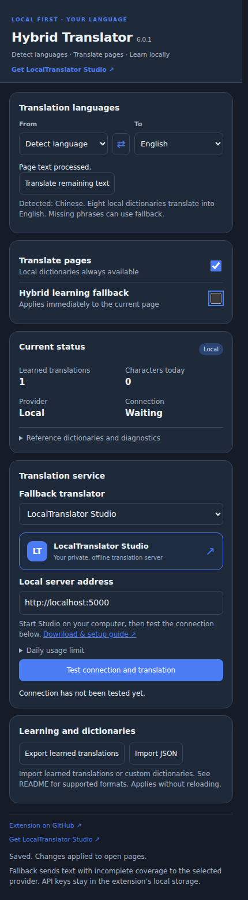

# Hybrid Web Translator

**Local dictionaries first. Optional translation services when you need them.**

[Português (Brasil)](readme-ptbr.md) · [LocalTranslator Studio](https://github.com/marcusbsilva/LocalTranslator-Studio) · [Dictionary sources](THIRD_PARTY_NOTICES.md)

Hybrid Web Translator is a Manifest V3 Chrome extension that translates webpages using fast offline dictionaries while preserving the DOM. It includes built-in integration with LocalTranslator Studio for optional local API translation, check: [LocalTranslator Studio](https://github.com/marcusbsilva/LocalTranslator-Studio)

## Interface



## Features

- **Language detection:** defaults to **Detect language → English**, with selectable source and target languages.
- **Offline dictionaries:** Chinese, Vietnamese, Thai, Russian, Portuguese, Spanish, French and Japanese, with English as a bridge for other destinations.
- **Learning:** local bilingual indexes and learned translations stored separately for each language pair.
- **Page support:** processes dynamic text and supported text attributes while leaving scripts and editable fields untouched.
- **Manual fallback:** translates uncovered text through the selected provider; activation applies immediately to the current page.
- **Provider options:** LocalTranslator Studio, Community Lingva, Google Cloud Translation and DeepL.
- **Diagnostics and tools:** connection testing, remaining-text retry, JSON import/export and local usage statistics.
- **Readable interface:** light and dark themes follow your system preference.

Dictionary entry counts indicate vocabulary size, not guaranteed coverage of complete sentences. With fallback disabled, unknown text may remain untranslated. Local dictionaries and previously learned translations work without a translation server.

## Installation

1. Extract the extension ZIP into a new folder.
2. Open `chrome://extensions` or `edge://extensions`.
3. Enable **Developer mode** and select **Load unpacked**.
4. Choose the folder containing `manifest.json`.
5. Reload existing website tabs once to activate the extension.

## Private local translation with LocalTranslator Studio

This version includes ready-to-use integration with LocalTranslator Studio. Install the application separately to use it as the extension’s local translation server.

1. Download and set up **[LocalTranslator Studio](https://github.com/marcusbsilva/LocalTranslator-Studio)**.
2. Start the server with `start.bat` on Windows or `bash start.sh` on Linux.
3. In the extension’s **Translation service** section, select **LocalTranslator Studio**.
4. Set **Local server address** to `http://localhost:5000`, or use your configured port.
5. Click **Test connection and translation**.
6. Enable **Hybrid learning fallback** manually when you want to translate text not covered by the dictionaries.

No API key is required. When you use a loopback address such as `localhost` or `127.0.0.1`, translation runs on your computer.

## Other providers and privacy

| Provider | Configuration | Where text is processed |
|---|---|---|
| LocalTranslator Studio | Local server address | On your computer when using a loopback address |
| Community Lingva | Instance URL | External community service |
| Google Cloud Translation | API key | External Google service |
| DeepL | API key | External DeepL service |

With fallback disabled, dictionary matching stays local. Enabling fallback sends eligible page text to the selected provider.

Settings, API keys and learned translations are stored in the extension’s local storage. Public instances may become unavailable. See [SECURITY.md](SECURITY.md) for security and privacy details.

## Dictionaries and crawler

The text-only crawler reads website URLs from `tools/sites.txt`, skips known phrases and writes incremental dictionary output as it works. It collects text without downloading images or other page assets.

Its default translation server is `http://localhost:5000`, so specifying the address is optional. Install the crawler requirements according to its guide, add the websites you want to analyze to `tools/sites.txt`, and run a command from the project root.

### Windows CMD

```bat
tools\crawl.bat
```

To use another server address or port:

```bat
tools\crawl.bat --translate-url http://localhost:5001
```

### Linux

```sh
bash tools/crawl.sh
```

To use another server address or port:

```sh
bash tools/crawl.sh --translate-url http://localhost:5001
```

Add `--no-translate` to collect text without requesting translations. Crawl output, caches and compiled Python files are generated locally and are not included in this release.

## License and attribution

Original extension code is licensed under [MIT](LICENSE). Dictionaries retain their individual CC BY-SA, GPL and other source-specific licenses.

Required notices, credit headers, source manifests and applicable corresponding source archives are included in the project and `third_party`. Preserve these when redistributing dictionary packs. See [THIRD_PARTY_NOTICES.md](THIRD_PARTY_NOTICES.md) for attribution and source details.

**Related application:** [LocalTranslator Studio](https://github.com/marcusbsilva/LocalTranslator-Studio)  
**Author:** [Marcus Silva](https://github.com/marcusbsilva)  
**Extension repository:** [Hybrid Web Translator](https://github.com/marcusbsilva/Hybrid-web-translator)
